# GardenaLocalControl

## Leading words

First, the explained method including installing the script or parts of software in this repository comes with some modification instructions for your Gardena components. Be warned with the all-known words at first: 

⚠️ BE AWARE YOU MAY LOSE YOUR WARRANTY! ANY MODIFICATIONS WILL BE DONE AT YOUR OWN RISK! THE GARDENA SUPPORT MAY NOT BE ABLE TO HELP YOU IF YOU BRICK YOUR GATEWAY OR DEVICE PERMANENTLY! ⚠️

This small script is for simple communication between the Gardena Smart Garden Gateway and a MQTT broker of your desire - **without any need of cloud infrastructure**. It has been tested with the Gardena Smart Garden Gateway (Art. No. 190005). Required prequisions are rooting the Gateway and enabling the nngforward-service (see [FAQ](#faq) below). The Bluetooth powered devices are not covered through this solution.

Note that this piece of software is currently in an early state. We wanted to push anything as soon as possible to share it to all of you. Take care with us 💚

## Installation

1.  Check requirements:

        Python3
        Python-PIP3

2.  Clone repository

        git clone https://github.com/andrexp/gardena-local-control.git
        cd gardena-local-control
3.  Edit config.py
    Customize your the config.py file for your needs. Especially the MQTT broker address should be set. To find out how to get the location of GARDENA_NNG_FORWARD_PATH_EVT and GARDENA_NNG_FORWARD_PATH_CMD see FAQ below.

Then you have two options to install:

1.  Install and execute\
    Simply use the "install"-script:

        sudo chmod +x install
        sudo ./install

    This will copy the gardenalocalcontrol.py script to /opt/gardenalocalcontrol and executes instantly after
2.  Install as server (OPTIONAL to 4.)
    Simply use the "install_service"-script:

        sudo chmod +x install_service
        sudo ./install_service

    This will also copy the gardenalocalcontrol.py script to /opt/gardenalocalcontrol but in addition a .service-File for systemd is created. This will install the script as service and make it start at boot automatically.

You have the following option to update GardenaLocalControl service:

Simply use the "update_service"-script:
    
    sudo chmod +x update_service
    sudo ./update_service
    
This will stop the service, copy all files and restart the gardenalocalcontrol.service.

## Status messages to receive via GardenaLocalControl
The script subscribes to the interprocess communication of lemonbeatd (rf-component which does communication with the wireless devices as the Gardena Smart Sileno mowers) and the Gardena cloud/shadoway connector. If a message is received, the script tries to interpet any component of it. Because not all of the information to be gathered is known at this point all information are pushed to the MQTT broker as it is. Therefore the following format and topics are used:

    GardenaLocalControl/<device_id>/<attribute> Value

device_id: Internal Device-ID of your Gardena device such as Smart Sileno mowers\
attribute: Interpreted data from subscription as described above

Example output for status-codes. For further information about status- and fault-codes see [FAQ](#faq):

    GardenaLocalControl/012345678901234567890/status 1                  # current status (e.g. if the id is a lawn mower, is mowing)

Example output for battery level:

    GardenaLocalControl/012345678901234567890/battery_level 70          # 70% battery power

Example output for rf-signal-strength:

    GardenaLocalControl/012345678901234567890/rf_link_quality 100       # best link quality

## Commands to send via GardenaLocalControl
For comfort several commands are available to send via MQTT. The main job is done by the script. Simply put a command to MQTT Topic: 

    GardenaLocalControl/<device_id>/Command

in the following JSON format:

    {
        "command": <command_name>,
        "payload": <payload_depending_on_command>
    }

### Available Commands
For the first step only basic commands are available for using it with a smart-home system as openHAB or Home-Assistant. More Commands e.g. for Gardena Smart Irrigation Control may follow later.
#### mower_timer
Start manual mowing with time period. According to app control the valid values are limited to 6 hours. 

accepted payload: integer value for mowing time in seconds (in example: 1 hour)

Example:

    GardenaLocalControl/012345678901234567890/Command
    {
        "command": "mower_timer",
        "payload": 3600
    }

#### start_schedule
Start mower with next schedule.

accepted payload: "true" (without quotes)

Example:

    GardenaLocalControl/012345678901234567890/Command
    {
        "command": "start_schedule",
        "payload": true
    }
#### park_until_next_task
Park mower until next schedule task would be started

accepted payload: "true" (without quotes)

Example:

    GardenaLocalControl/012345678901234567890/Command
    {
        "command": "park_until_next_task",
        "payload": true
    }
#### park_until_further_notice
Park mower permanently

accepted payload: "true" (without quotes)

Example:

    GardenaLocalControl/012345678901234567890/Command
    {
        "command": "park_until_further_notice",
        "payload": true
    }

#### read_status
Read the status of given deviceid through topic address. The answer of the command will be published to the event-queue. Many interesting information can be gathered. It may be useful to build a rule in an external smart home application like openHAB or HomeAssistant to call this function cyclic.

accepted payload: "true" (without quotes)

Example:

    GardenaLocalControl/012345678901234567890/Command
    {
        "command": "read_status",
        "payload": true
    }

## FAQ

### How do I root my Gardena Smart Gateway and prepare it for using the script
BE AWARE YOU WILL LOSING WARRANTY! ANY MODIFICATIONS WILL BE DONE AT YOUR OWN RISK!

1.  Connect to the UART of the Board. You will find the Pins and required settings in the official [Gardena documentation](https://github.com/husqvarnagroup/smart-garden-gateway-public), you will need a USB to UART-Adapter or a RaspberryPi to be able to connect your computer.
2.  Use a terminal application such as PuTTy (on Windows) or screen (on Linux)
3.  Connect power of the gateway
4.  Wait until you see a login shell usually something like:

        GARDENA-12affe12 login: 

    will appear.
5.  Quickly type in "root" (without quotes)
6.  You have successful gained root access
7.  Put in your public SSH key and don't forget to use following command to prevent deletion of the key in case of a firmware upgrade:

        fw_setenv dev_debug_allow_local_ssh 1

8.  Enable nngforward by the following command:

        fw_setenv dev_debug_enable_nngforward 1

9.  Have fun!
 

### Help! I installed the script onto my gateway, all files seem to be deleted after a firmware upgrade
You have to put your files into the file to exclude via firmware updates. See [How do I determine the location of GARDENA_NNG_FORWARD_PATH_EVT and GARDENA_NNG_FORWARD_PATH_CMD](#how-do-i-determine-the-location-of-gardena_nng_forward_path_evt-and-gardena_nng_forward_path_cmd)
 

### How do I determine the location of GARDENA_NNG_FORWARD_PATH_EVT and GARDENA_NNG_FORWARD_PATH_CMD
This files are used to create the pipe for accessing the interprocess communication. After enabling the

    dev_debug_enable_nngforward

flag the gateway prepares the local access to the lemonbeatd communication. You have two options to install your script:

1.  You install the script with root access onto your gateway directly. Be aware the files will be deleted in case of a firmware upgrade. To avoid that include your script directory into:

        /etc/sysupgrade.conf

    It's recommended to add the following files/paths to this file:

        /opt
        /home/root/.ssh/authorized_keys
        /usr/lib/python3.8/site-packages

    If you have installed gardena-local-control as a service add the following additionally:

        /etc/systemd/system/gardenalocalcontrol.service
        /etc/systemd/system/multi-user.target.wants/gardenalocalcontrol.service

    Tip: For this method you don't really need to enable the nngforward. The files mentioned in the default config.py are existent. This is only needed if you plan to install the script on a different machine in your network.

    In addition keep in mind that the storage of the Gardena Smart Gateway is limited. There are only a few megabytes free. If you install all the dependencies and you want to have some logging on it you may run out of space. But the main advantage of this method is you don't need to care about networking problems. Why this is important? See next solution.

2.  You install the script on another machine e.g. a RaspberryPi or any other SoC. If you do so you have to mirror the communication ports onto the serving machine with:

        socat UNIX-LISTEN:/tmp/lemonbeatd-event.ipc,fork,reuseaddr,unlink-early TCP:192.168.178.151:28152 &
        socat UNIX-LISTEN:/tmp/lemonbeatd-command.ipc,fork,reuseaddr,unlink-early TCP:192.168.178.151:28153 &

    Keep in mind to check if the process is killed. In this case the communication to the gateway will be lost and no information can be gathered.
 
### Where can I find the device_id
The simplest way to obatin your desired device_id is to observe the output of the GardenaLocalControl when controlling e.g. a mower or any other device through the App.
 

### Where can I find information about the status- and fault-codes?
You can find status- and fault-codes within the following MQTT-topics:

    GardenaLocalControl/<device_id>/status
    GardenaLocalControl/<device_id>/last_error_code

Unfortunately this is a enumeration which is not fully discovered, yet. We started to reverse engineer the fault codes from the Garden Smart System App. You will find a small documentation with results included in [docs/control_telegram](docs/control_telegram)
 

### Could you help with a example configuration for openHAB?
Of course!

1.  First, install [MQTT-Binding](https://www.openhab.org/addons/bindings/mqtt/)
2.  Create a new MQTT Thing "Generic MQTT Thing"\
    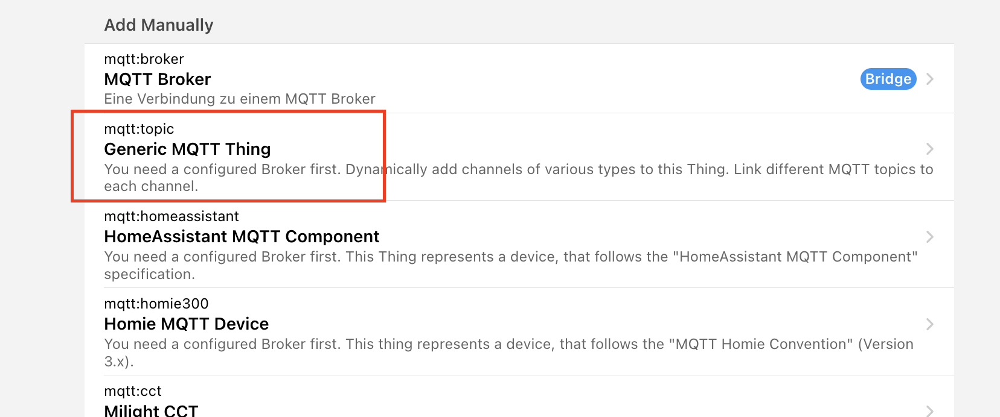
3.  Go to the newly created MQTT Thing which we call "MQTT Things", click on "Channels"\
    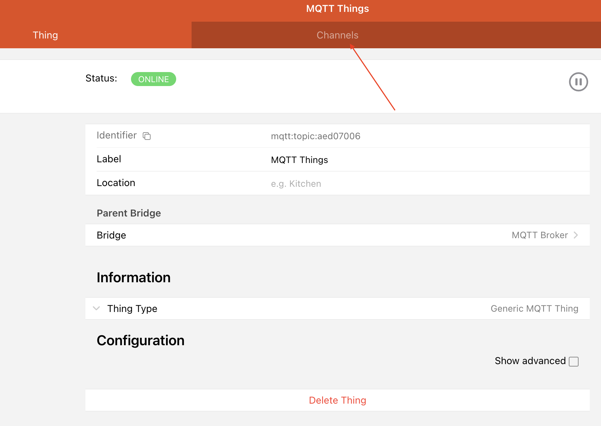
4.  Create a new MQTT topic listener by clicking "Add Channel"\
    
5.  The first example creates a listener to the "status" topic of a lawn mower. So we create a "Number" value.
    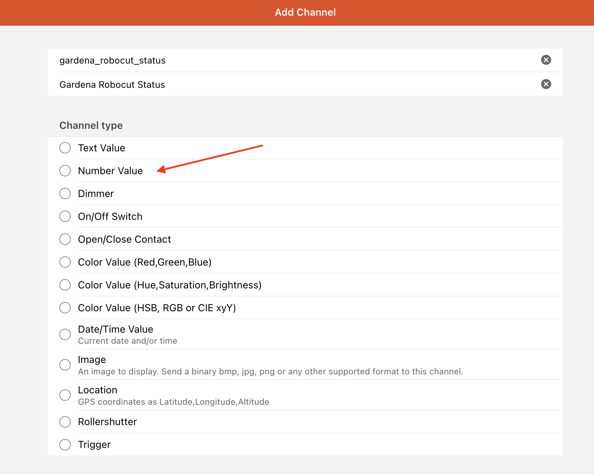
6.  Click on "Configure channel" of the newly created MQTT Thing channel\
    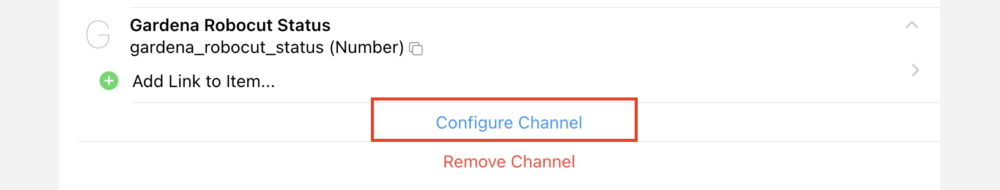
7.  Fill in the "MQTT State Topic"-field as mentioned [above](#status-messages-to-receive-via-gardenalocalcontrol)\
    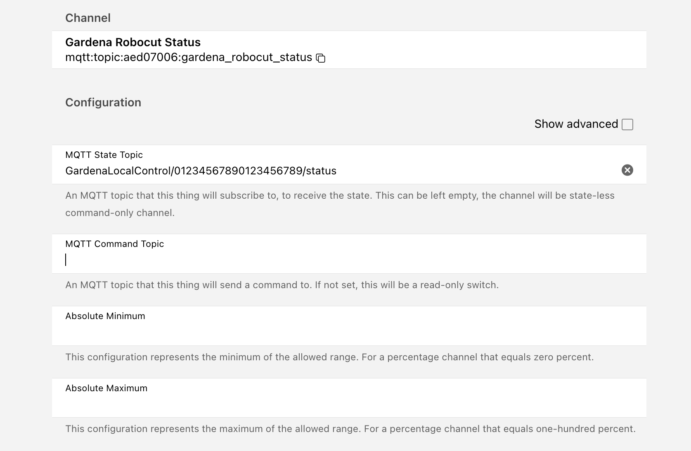
8.  Now we just need to add a existing create a new openHAB item\
    
9.  In this example we create a "Number"-item\
    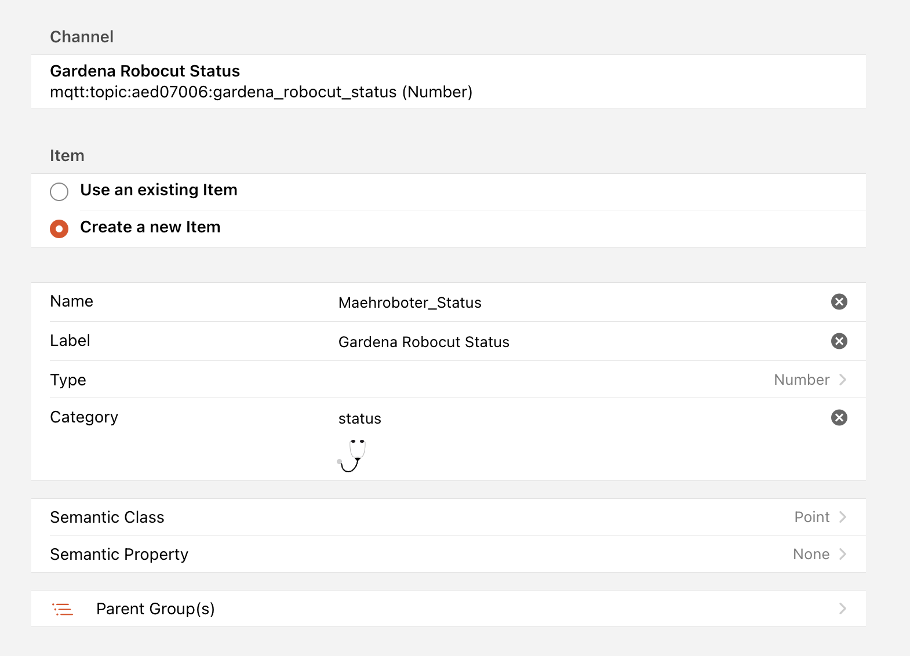
10.  We are finished. Note that the status is NULL as long as GardenaLocalControl transmits the first status value. This could take some time. Usually you can force send a status value by sending a command to the gateway.\
    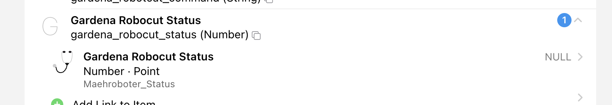
11. Second example: Create the command topic. We do exactly the same steps 3.-6. Note that we now want to have a "Text Value" instead of a "Number". Remember this at point 5. After creating the channel we fill in both: "MQTT Status Topic" and "MQTT Command Topic"\
    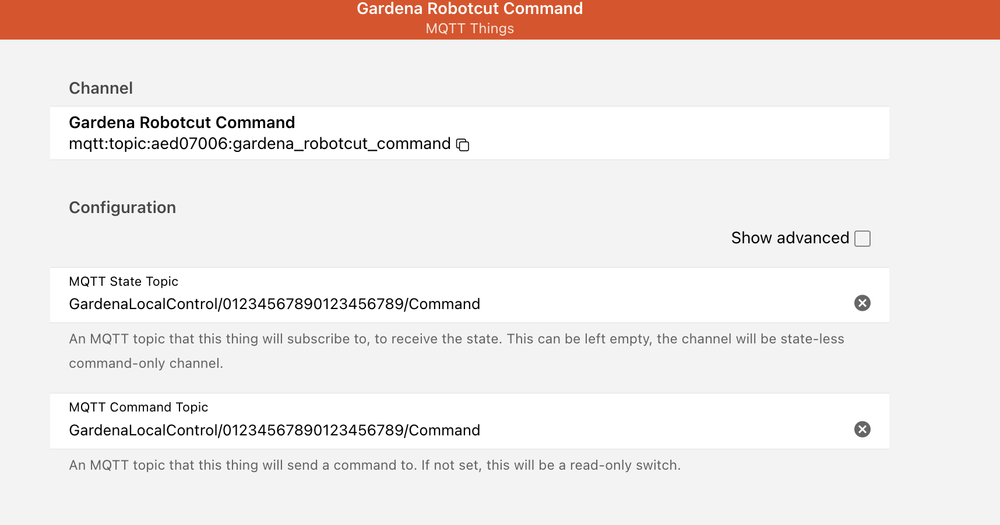
12. Hit the check-box "Show advanced"\
    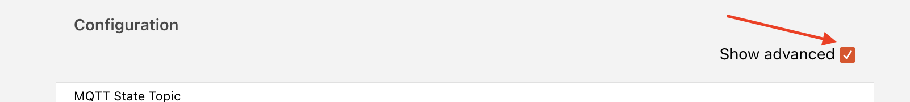
13. Fill in the fields for "Incoming Value Transformations". By using JSONPATH we can extract the command from the transmitted JSON-string of the command topic message payload.\
    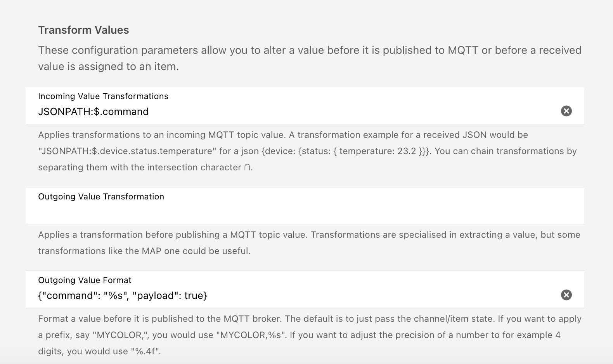
14. Again create a new openHAB item as described in 8. We now choose "String" as type. For simple usage add a "Meta Data" to create command options.\
    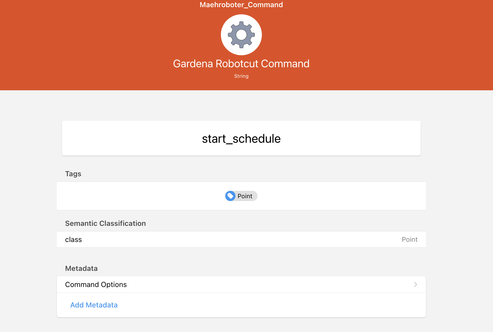
15. Insert all available commands so you can easily use them by clicking on items current value.\
    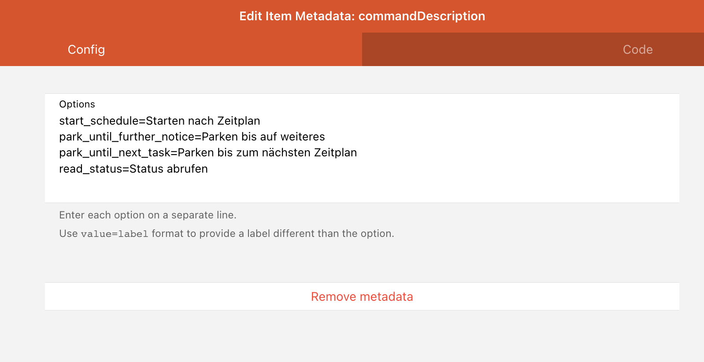

## Thanks to the Gardena devs for the hints and the support!
[@rettichschnidi](https://github.com/rettichschnidi)\
[@easybe](https://github.com/easybe)\
[@broglep-work](https://github.com/broglep-work)